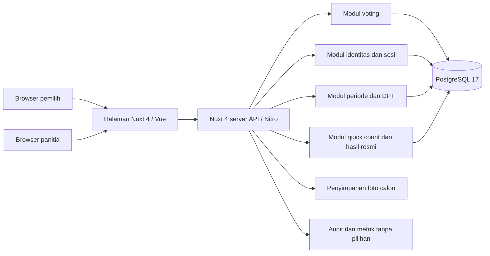
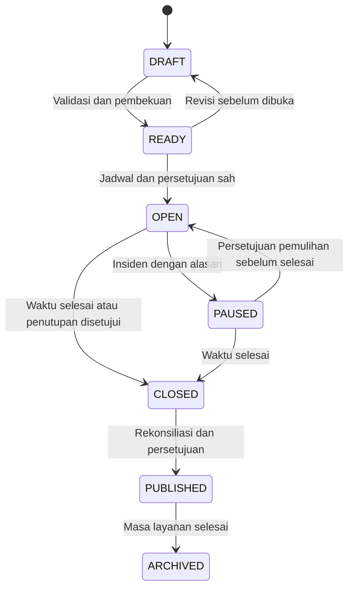
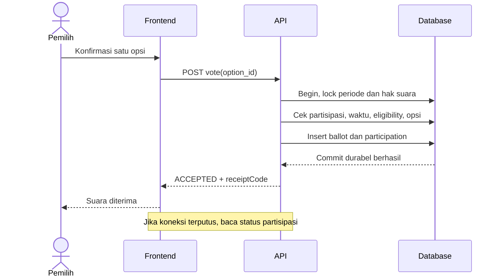

# SDD PEMIRA

Versi 0.5 · 14 September 2026 · Draft

## 1. Acuan dan batas rancangan

Dokumen ini menjabarkan [PRD](PRD.md). Workspace saat penulisan berisi folder `frontend/` dan `backend/` kosong. Arsitektur, tabel, endpoint, dan prosedur di sini belum diimplementasikan. Pemilik proyek menyetujui full-stack Nuxt 4 menggantikan Nuxt 3 pada D-07. Rancangan menggunakan TypeScript, halaman Vue, dan API server Nitro dalam satu project. Deployment menggunakan VPS dengan panel EasyPanel. Database ditetapkan PostgreSQL 17. Login lokal menggunakan NIM/NIP dan password dari panitia. VPS memiliki 4 core CPU dan RAM 8 GB untuk sekitar 600 pemilih, berbagi dengan project lain. Driver, domain, penyimpanan dan backup masih perlu dirinci pada [DECISIONS](DECISIONS.md).

Hak suara awal mahasiswa/dosen terdiri dari pasangan BEM, pasangan MPM, ketua Hima, dan wakil ketua Hima sesuai jurusan. Admin dapat menyesuaikan hak per orang atau massal di DRAFT. BEM/MPM memakai opsi PAIR; tiap jurusan memiliki dua kontes Hima bertipe SINGLE. Total sepuluh kontes, dengan empat hak awal per orang. Pada setiap kontes pemilih hanya memilih satu opsi; dua jabatan Hima tidak digabung dalam satu pengiriman.

## 2. Arsitektur

Gunakan satu aplikasi full-stack Nuxt 4: halaman web responsif dan backend modular di server Nitro. PostgreSQL menyediakan database transaksional dengan constraint unik dan penguncian baris untuk implementasi bagian 7. Model ini memusatkan validasi hak suara dan pencatatan suara dalam satu transaksi. Penyimpanan foto terpisah dari database transaksi.



Backend merupakan sumber kebenaran untuk izin, waktu, status, dan penerimaan suara. Browser tidak menentukan hak suara dari jurusan yang dikirim pengguna. Cache hanya untuk konten publik; status hak suara dan penerimaan suara selalu dibaca dari penyimpanan otoritatif.

| Modul | Tanggung jawab |
| --- | --- |
| Identity | Verifikasi identitas, sesi, pemulihan akun, peran, autentikasi ulang password petugas |
| Election | Periode, kontes, calon, jadwal, status, pengajuan dan persetujuan tindakan |
| Registry | Input manual/impor Excel/CSV pemilih, validasi, pengaturan hak pilih, snapshot dan pembekuan |
| Voting | Validasi permintaan dan transaksi penerimaan suara |
| Results | Quick count agregat, rekonsiliasi, snapshot hasil resmi, ekspor dan publikasi |
| Audit | Catatan tindakan administrasi yang tidak dapat diubah lewat aplikasi |

### Arah antarmuka

Gunakan [DESIGN](../DESIGN.md) sebagai acuan visual: modern light, `#2A6B5C`, `#FFF9F2`, dan Inter. Implementasi menempatkan token warna serta font pada aset antarmuka, dengan komponen yang memeriksa kondisi fokus, error, memuat, dan layar kecil. Sediakan Inter lokal dengan fallback agar halaman tetap terbaca ketika font belum termuat. Pemeriksaan visual dijadwalkan pada PH-1 dan validasi akhir PH-7.

### Implementasi Nuxt 4

Tempatkan halaman publik, pemilih, dan admin di `app/pages/`, komponen bersama di `app/components/`, serta API di `server/api/v1/`. Nuxt memberi prefix `/api` pada handler di `server/api`; nama file dapat membatasi metode HTTP. Contoh pemetaan: `server/api/v1/contests/[id]/votes.post.ts` melayani `POST /api/v1/contests/:id/votes`. Nuxt 4 menempatkan kode antarmuka di `app/` dan server di root project. [Struktur Nuxt 4](https://nuxt.com/docs/4.x/directory-structure).

Handler memeriksa sesi, izin, payload, dan state, lalu memanggil layanan domain di `server/services/`. Layanan voting menjalankan satu transaksi database menggunakan koneksi yang sama untuk lock, partisipasi, dan surat suara. Lapisan repository menggunakan query SQL berparameter melalui driver PostgreSQL dengan pool kecil; driver final dipilih saat implementasi. Seluruh operasi pada bagian 7 harus memakai satu koneksi transaksi; tidak boleh mengganti transaksi dengan beberapa request database terpisah.

Middleware halaman mengarahkan pengguna yang belum login untuk kenyamanan navigasi. Setiap API tetap menegakkan autentikasi dan otorisasi sendiri, termasuk akses admin, unggahan, dan impor. Pemeriksaan sesi dijalankan di server route. Metode login adalah akun lokal; library sesi/hash dipilih saat implementasi sesuai bagian 5. [Autentikasi Nuxt 4](https://nuxt.com/docs/4.x/guide/recipes/sessions-and-authentication).

Simpan URL database, secret sesi, dan kredensial penyimpanan pada runtime config privat. `runtimeConfig.public` hanya berisi konfigurasi yang boleh dibaca browser; jangan meletakkan secret di sana atau mengembalikannya melalui API. [Runtime config Nuxt 4](https://nuxt.com/docs/4.x/api/composables/use-runtime-config).

Deployment ditetapkan pada VPS yang dikelola melalui panel EasyPanel. Usulan runtime aplikasi adalah Node.js untuk keluaran server Nitro. Deployment harus menyediakan proses server aktif bagi API voting; ekspor situs statis saja tidak memenuhi kebutuhan ini. Nuxt mendokumentasikan preset `node-server`; versi Node.js dan patch Nuxt 4 dipilih setelah verifikasi kompatibilitas saat implementasi. Kunci versi yang dipilih pada manifest dan lockfile, tanpa menaikkan major berikutnya secara otomatis. [Deployment Nuxt 4](https://nuxt.com/docs/4.x/getting-started/deployment).

Rancangan sesi, DPT, idempotensi, serta file tidak boleh bergantung pada memori satu proses Nuxt. Gunakan database untuk state otoritatif dan penyimpanan file durabel untuk foto/DPT. Gunakan rendering sisi browser untuk MVP (`ssr: false`) agar server tidak merender Vue per kunjungan; server Nitro tetap menjalankan API pada build production. Cache publik hanya boleh berisi shell/aset dan agregat quick count, tanpa data sesi. API akun, admin, hak pilih, dan voting tidak boleh diprerender atau disimpan dalam cache bersama. Jadwal pembukaan/penutupan menggunakan penjadwal operasional yang dapat dipantau; setiap handler voting tetap mengecek waktu database meskipun penjadwal terlambat.

## 3. Model data

ID menggunakan nilai acak yang tidak mengandung nomor identitas pemilih. Waktu disimpan dalam UTC dan ditampilkan dalam Asia/Jakarta. Jadwal yang dimasukkan panitia harus menampilkan zona waktu secara eksplisit.

| Entitas | Kolom utama | Batasan |
| --- | --- | --- |
| departments | id, code, name | code unik; empat jurusan awal dari brief |
| voters | id, voter_type, identifier_type, identifier_value, name, department_id, active_status | voter_type STUDENT/LECTURER; unik identifier_type + identifier_value; nomor identitas berupa teks; satu orang dipetakan ke satu voter |
| users | id, login_kind, login_identifier, password_hash, credential_version, voter_id nullable, active | Unik login_kind + login_identifier; voter_id unik bila terisi; login_kind STUDENT/LECTURER/ADMIN; tanpa password plaintext |
| sessions | id_hash, user_id, credential_version, expires_at | Token sesi acak pada cookie; hash token tersimpan, dapat dicabut saat logout/reset password |
| role_assignments | user_id, role, election_id nullable | Kombinasi unik; scope periode diperiksa server |
| elections | id, name, status, starts_at, ends_at, config_version | ends_at > starts_at; perubahan konfigurasi menaikkan versi |
| contests | id, election_id, code, title, scope_department_id nullable, office, option_type | Unik election_id + code; BEM/MPM office PAIR dan tipe PAIR; Hima office CHAIR/VICE_CHAIR dan tipe SINGLE |
| candidate_options | id, contest_id, number, photo_key, motto, vision, mission, programs nullable, active | Unik contest_id + number; tambahkan unique contest_id + id untuk FK gabungan |
| candidate_members | id, option_id, name, position | PAIR wajib satu ketua dan satu wakil; SINGLE tepat satu calon |
| voter_roll_entries | id, election_id, voter_id, voter_type_snapshot, department_id_snapshot | Unik election_id + voter_id; snapshot jurusan tidak berubah saat voting |
| voting_rights | id, roll_entry_id, contest_id, election_id, source | source DEFAULT/ADMIN; unik roll_entry_id + contest_id; FK gabungan memastikan DPT dan kontes satu periode |
| participations | voting_right_id, contest_id, receipt_code | voting_right_id primary key; receipt_code acak dan unik; tidak memuat opsi calon |
| ballots | id, contest_id, option_id | FK gabungan contest_id + option_id; tanpa voter_id, right_id, receipt_code, atau waktu suara presisi |
| admin_actions | id, election_id, type, payload, config_version, proposer_id, approver_id, status | Pengusul berbeda dari penyetuju; persetujuan terikat versi/payload |
| result_snapshots | id, election_id, version, totals, checksum, created_at, published_at | Unik election_id + version; snapshot yang dipublikasikan immutable |
| audit_events | id, actor_id, election_id, action, target, redacted_changes, occurred_at | Append-only melalui aplikasi; tidak menyimpan pilihan atau credential |
| import_batches | id, election_id, state, counts, errors, created_by | Data sementara memiliki akses terbatas dan masa simpan pendek |

`participations.contest_id` harus cocok dengan kontes pada hak suara melalui FK gabungan. Hubungan antarperiode pada `voting_rights` juga ditegakkan di database, bukan hanya pemeriksaan frontend. Validasi jumlah/peran anggota calon, foto opsi, moto, visi, dan misi wajib lulus sebelum READY. Foto berada di tingkat opsi: satu foto pasangan untuk PAIR, satu foto individu untuk SINGLE.

Tidak ada hubungan langsung antara `ballots` dan `participations`. Keduanya dibuat dalam transaksi yang sama sehingga totalnya tetap cocok. Pemisahan ini mencegah fitur aplikasi membaca pilihan berdasarkan identitas, tetapi bukan bukti anonimitas terhadap administrator database: metadata transaksi, urutan write, dan cadangan dapat memungkinkan korelasi. Jika ancaman tersebut masuk cakupan, hentikan implementasi voting berdasarkan model ini dan revisi D-12 untuk desain dengan tinjauan keamanan khusus.

### Daftar kontes awal

| Kode | Surat suara | Tipe | Jurusan default |
| --- | --- | --- | --- |
| BEM | Ketua dan wakil BEM | PAIR | Semua |
| MPM | Ketua dan wakil MPM | PAIR | Semua |
| HIMA_KEP_CHAIR | Ketua Hima Keperawatan | SINGLE | Keperawatan |
| HIMA_KEP_VICE | Wakil ketua Hima Keperawatan | SINGLE | Keperawatan |
| HIMA_KEB_CHAIR | Ketua Hima Kebidanan | SINGLE | Kebidanan |
| HIMA_KEB_VICE | Wakil ketua Hima Kebidanan | SINGLE | Kebidanan |
| HIMA_KG_CHAIR | Ketua Hima Kesehatan Gigi | SINGLE | Kesehatan Gigi |
| HIMA_KG_VICE | Wakil ketua Hima Kesehatan Gigi | SINGLE | Kesehatan Gigi |
| HIMA_OP_CHAIR | Ketua Hima Ortotik Prostetik | SINGLE | Ortotik Prostetik |
| HIMA_OP_VICE | Wakil ketua Hima Ortotik Prostetik | SINGLE | Ortotik Prostetik |

Setiap calon SINGLE memiliki posisi yang sesuai dengan office kontes. Calon ketua dan wakil tidak berbagi option_id. Untuk 600 pemilih dengan default empat hak, ada 2.400 hak; angka final mengikuti penyesuaian admin. Kesepuluh kode di atas adalah usulan identifier internal, bukan kode resmi kampus.

## 4. Siklus periode dan pembekuan



- READY mensyaratkan sepuluh kontes, DPT valid, hak suara terbentuk, calon lengkap, jadwal valid, dan aturan kontes disahkan. Bila ada kontes tanpa calon, panitia harus menetapkan kebijakan sebelum periode dapat READY.
- Kembali ke DRAFT membatalkan persetujuan terdahulu. DPT, hak suara, dan calon hanya dapat diubah di DRAFT.
- OPEN tidak boleh mengubah DPT, calon, eligibility, atau jadwal. Perpanjangan jadwal merupakan perubahan cakupan yang perlu aturan tambahan, bukan endpoint edit biasa.
- Penjadwal membantu perubahan status, tetapi setiap pengiriman suara tetap memeriksa waktu database. Keterlambatan penjadwal tidak memperpanjang voting.
- CLOSED tidak dapat kembali ke OPEN. Pemilihan ulang dibuat sebagai periode baru dengan rujukan keputusan panitia, tanpa menghapus hasil lama.
- Menjeda darurat boleh dilakukan satu petugas berwenang agar respons cepat; pemulihan dan penutupan lebih awal memerlukan persetujuan petugas berbeda.

## 5. Autentikasi dan otorisasi

Pemilih memilih jenis mahasiswa atau dosen, lalu memasukkan NIM atau NIP lokal dan password dari panitia. Identitas berupa teks tanpa asumsi panjang NIP nasional. Kombinasi jenis + identitas membedakan NIM dan NIP yang kebetulan sama. Admin memakai akun berperan khusus; memilih jenis dosen tidak memberikan akses admin. Tidak ada OTP, email verifikasi, SSO kampus, atau registrasi publik.

Panitia dapat menetapkan password awal lewat form, mengisi kolom opsional `initial_password` pada impor, atau meminta sistem menghasilkan password acak unik per akun. Password untuk akun yang sudah ada tidak ditimpa melalui impor DPT ulang; perubahan memakai alur reset khusus. Password tidak boleh disamakan untuk seluruh pemilih.

Usulan minimum password lokal 12 karakter; generator membuat minimal 16 karakter acak. Hash menggunakan Argon2id dengan salt per password; baseline minimum 19 MiB, 2 iterasi, paralelisme 1, lalu benchmark pada limit container. Batasi pekerjaan hash bersamaan, awalnya dua, untuk menjaga RAM/CPU; jangan menurunkan biaya hash hanya untuk mempercepat login. [Pedoman penyimpanan password OWASP](https://cheatsheetseries.owasp.org/cheatsheets/Password_Storage_Cheat_Sheet.html).

File/permintaan berisi password hanya diproses di jalur provisioning terlindungi. Hash sebelum menyimpan batch pratinjau; jangan mempertahankan file mentah yang mengandung password. Pratinjau dan laporan error menyamarkan kolom password. Data distribusi password yang dihasilkan hanya ditampilkan/diunduh sekali pada aksi eksplisit admin, dengan respons no-store, tanpa arsip server atau log; audit mencatat aksi dan jumlah akun, bukan password. Setelah itu, password lama tidak dapat dibaca kembali. Jika paket distribusi tidak tersimpan oleh panitia, gunakan reset untuk menerbitkan yang baru.

Panitia membagikan akses langsung kepada pemilih melalui prosedur lokal. Reset setelah pemeriksaan identitas mencabut seluruh sesi akun, menaikkan credential_version, dan tidak mengubah hak/partisipasi. Sediakan perubahan password mandiri dengan password saat ini; perubahan pertama tidak dipaksakan agar tidak menambah langkah saat pemilihan. Panitia yang mengetahui password tetap berada dalam batas kepercayaan; sistem tidak dapat menjamin mereka tidak memakai akun pemilih.

Sesi menggunakan token acak dengan cookie Secure, HttpOnly, SameSite yang sesuai dan perlindungan CSRF untuk mutasi. Usulan kedaluwarsa absolut 8 jam. Sesi divalidasi pada setiap API, dirotasi setelah login, dan dicabut setelah logout, reset, atau deaktivasi akun. Password/token tidak boleh masuk URL, analitik, atau penyimpanan browser yang dapat dibaca skrip.

Login salah memakai pesan umum dan rate limit per akun serta IP yang memperhitungkan banyak pemilih di jaringan kampus. Lonjakan hash dibatasi antrean pendek; request berlebih memperoleh respons yang dapat dicoba ulang, tanpa mengunci akun secara permanen. Batas antrean dan laju dituning melalui uji 600 login. Pekerjaan hash hanya dilakukan pada login/provisioning/perubahan password, tidak di dalam transaksi voting. Endpoint voting memvalidasi sesi dan tetap menerima body hanya option_id.

Setiap API memeriksa peran dan scope periode. voter_id berasal dari sesi, bukan payload pengguna. Pengawas hanya membaca; petugas DPT tidak dapat memublikasikan hasil atau memberi role sendiri. Tindakan kritis admin meminta autentikasi ulang password, tanpa OTP. Persetujuan dua akun berbeda masih merupakan usulan D-10 yang menunggu panitia.

## 6. Kontrak API usulan

Awalan `/api/v1`. Respons kesalahan berbentuk `{ "error": { "code": "...", "message": "..." } }`; jangan mengembalikan payload pilihan, credential, stack trace, atau status milik pemilih lain. Login lokal mengikuti bagian 5; tidak ada callback SSO atau OTP.

| Metode dan endpoint | Akses | Perilaku |
| --- | --- | --- |
| GET /public/elections/:id | Publik | Informasi periode dan jadwal yang dipublikasikan |
| GET /public/elections/:id/candidates | Publik | Profil calon yang disetujui, tanpa data kontak pribadi |
| GET /public/elections/:id/results | Publik | Snapshot PUBLISHED; sebelum itu RESULTS_NOT_PUBLISHED |
| POST /auth/login | Publik | Body login_kind, identifier, password; rate limit dan sesi lokal |
| POST /auth/change-password | Login | Verifikasi password saat ini, simpan hash baru, cabut sesi lama |
| GET /public/elections/:id/quick-count | Publik | Agregat sementara sejak OPEN, cached maksimal 5 detik; tidak memuat identitas |
| GET /me | Login | Profil minimal dan peran pengguna |
| POST /auth/logout | Login | Membatalkan sesi aktif |
| GET /me/elections/:id/contests | Pemilih | Kontes eligible dan status partisipasi sendiri |
| GET /me/contests/:id/participation | Pemilih eligible | NOT_CAST atau ACCEPTED serta receipt_code jika sudah diterima |
| POST /contests/:id/votes | Pemilih eligible | Body hanya option_id; menjalankan transaksi pada bagian 7 |
| POST /admin/elections | Panitia | Membuat DRAFT |
| PATCH /admin/elections/:id | Panitia | Mengubah konfigurasi hanya saat DRAFT |
| GET /admin/elections/:id/voters | Petugas DPT/panitia | Daftar dan pencarian pemilih, filter jenis/jurusan/status, pagination |
| POST /admin/users/:id/reset-password | Petugas akun berizin | Tetapkan/generate password baru, cabut sesi, audit tanpa rahasia |
| POST /admin/elections/:id/credentials/provision | Petugas akun berizin | Password awal akun baru terpilih, keluaran distribusi sekali saja; login tetap terpisah dari hak suara |
| POST /admin/elections/:id/voters | Petugas DPT | Input satu pemilih manual di DRAFT dan pembentukan hak awal |
| PATCH /admin/elections/:id/voters/:voterId | Petugas DPT | Edit data di DRAFT; pratinjau dampak bila jurusan/jenis berubah |
| GET /admin/elections/:id/voter-template | Petugas DPT | Template impor .xlsx atau .csv dan daftar kode valid |
| POST /admin/elections/:id/imports | Petugas DPT | Unggah Excel/CSV, pemetaan kolom, validasi dan pratinjau |
| GET /admin/imports/:id | Petugas DPT | Status batch, ringkasan, dan kesalahan per baris |
| GET /admin/elections/:id/voters/:voterId/rights | Panitia | Enam kontes beserta hak tersimpan untuk pemilih |
| POST /admin/elections/:id/rights/preview | Panitia | Pratinjau beri/cabut hak untuk daftar pemilih tertentu; mengembalikan token terikat config_version dan daftar sasaran |
| POST /admin/elections/:id/rights/commit | Panitia | Terapkan perubahan dari token pratinjau, alasan wajib, hanya DRAFT; versi usang ditolak |
| POST /admin/imports/:id/commit | Petugas DPT | Menyimpan batch valid secara atomik selama DRAFT |
| POST /admin/elections/:id/contests | Panitia | Membuat kontes saat DRAFT |
| PATCH /admin/contests/:id | Panitia | Mengubah format/scope saat DRAFT |
| POST /admin/contests/:id/options | Panitia | Membuat opsi PAIR BEM/MPM atau SINGLE ketua/wakil Hima saat DRAFT |
| PATCH /admin/options/:id | Panitia | Mengubah nama pasangan/individu, nomor, moto, visi, misi, dan program opsional saat DRAFT |
| POST /admin/options/:id/photo | Panitia | Unggah/ganti foto opsi pasangan/individu melalui multipart, hanya DRAFT |
| POST /admin/elections/:id/ready | Panitia | Memvalidasi dan membekukan konfigurasi |
| POST /admin/elections/:id/revise | Panitia | READY ke DRAFT dan membatalkan persetujuan |
| POST /admin/elections/:id/actions | Panitia | Mengajukan pembukaan, pemulihan, penutupan awal, publikasi, atau pengarsipan |
| POST /admin/actions/:id/approve | Penyetuju berbeda | Memeriksa ulang versi, izin, dan state sebelum menyetujui |
| POST /admin/elections/:id/pause | Panitia | Menjeda darurat dengan alasan dan audit |
| GET /admin/elections/:id/participation | Panitia/pengawas | Statistik agregat tanpa pilihan |
| POST /admin/elections/:id/reconcile | Panitia | Rekonsiliasi saat CLOSED, membuat snapshot jika cocok |
| GET /admin/elections/:id/results | Panitia/pengawas | Rekap sementara saat OPEN/PAUSED; snapshot resmi mengikuti status publikasi |
| GET /admin/elections/:id/results/export | Panitia/pengawas | Ekspor agregat berlabel sementara/resmi sesuai status, diaudit |
| GET /admin/elections/:id/audit | Pengawas/petugas berizin | Audit dengan penyaringan data sensitif |

Status HTTP: 201 untuk suara baru; 200 untuk status hak yang sudah digunakan; 400 untuk payload salah; 401 untuk sesi tidak sah; 403 untuk hak/peran tidak sesuai; 404 untuk resource tidak ditemukan; 409 untuk state tidak memungkinkan; 422 untuk opsi tidak valid; 429 untuk batas permintaan; 503 untuk layanan sementara tidak tersedia. Jangan menyamarkan kegagalan commit sebagai keberhasilan.

## 7. Transaksi penerimaan suara

Invarian: satu `voting_right` menghasilkan paling banyak satu `participation`; setiap partisipasi baru disertai tepat satu `ballot` dalam commit yang sama. Gunakan unique constraint sebagai pengaman akhir, bukan pengecekan UI.

Urutan transaksi yang harus diterapkan:

1. Verifikasi sesi dan bentuk payload, kemudian mulai transaksi database.
2. Ambil row lock `FOR SHARE` pada baris periode dan pertahankan sampai transaksi selesai. Transisi status mengambil `FOR UPDATE` pada baris yang sama sehingga menunggu voting aktif selesai. Shared lock memungkinkan pemilih berbeda mengirim bersamaan.
3. Ambil row lock `FOR UPDATE` pada hak suara milik pemilih untuk kontes tersebut. Urutan lock selalu periode lalu hak suara untuk mengurangi deadlock.
4. Jika hak tidak ada, rollback dengan NOT_ELIGIBLE. Jika partisipasi sudah ada, akhiri tanpa write dan kembalikan ACCEPTED serta receipt_code yang sama. Respons tidak menyatakan calon dalam request ulang telah dipilih.
5. Periksa status OPEN dan waktu database aktual (`clock_timestamp()`) setelah memperoleh lock: starts_at ≤ waktu validasi < ends_at. Jangan gunakan jam browser atau timestamp awal transaksi yang mungkin sudah usang setelah menunggu lock.
6. Periksa opsi calon aktif dan benar-benar milik kontes tersebut.
7. Buat ID surat suara acak dan receipt_code acak yang berbeda serta tidak saling diturunkan. Insert surat suara tanpa identitas dan insert partisipasi tanpa pilihan.
8. Commit. Hanya sesudah commit durabel berhasil, kirim 201 dengan `{ "status": "ACCEPTED", "receiptCode": "..." }`.
9. Pada error, rollback seluruh transaksi. Untuk deadlock/transient failure, lakukan retry terbatas dengan pemeriksaan ulang hak suara. Jika status commit tidak diketahui, periksa ulang partisipasi pada koneksi baru sebelum menyatakan hasil.

Idempotensi menggunakan hak suara sebagai kunci alami. Dua kiriman dengan opsi berbeda untuk hak yang sama tetap menghasilkan satu suara; pilihan yang pertama berhasil commit berlaku. Kiriman kedua hanya memperoleh status sudah diterima, tanpa mengonfirmasi opsi kiriman kedua. Tidak perlu menyimpan hash pilihan yang dapat menjadi penghubung identitas dengan surat suara.

Batas waktu berlaku saat validasi pada langkah 5. Transaksi yang lolos sebelum batas boleh commit sesaat setelah batas; transaksi yang menunggu lock sampai batas lewat ditolak. Penutupan dengan exclusive lock menunggu transaksi yang telah masuk selesai sebelum rekap dibuat. Tetapkan timeout transaksi pendek dan uji perilaku ini sebagai bagian dari aturan operasional.



Frontend menonaktifkan tombol selama request berjalan untuk kenyamanan, tetapi tidak mengandalkannya untuk mencegah duplikasi. Pilihan sementara hanya berada di memori halaman; jangan kirim ke analitik, URL, atau simpan sebagai draft di server.

## 8. DPT, eligibility, dan unggahan

### Data pemilih dan format impor

Form manual dan impor memakai field yang sama: `voter_type` (STUDENT/LECTURER), `identifier_type`, `identifier_value`, `name`, `department_code`, dan `active_status`. Mahasiswa memakai NIM; dosen memakai NIP lokal yang disediakan panitia. identifier_type harus cocok dengan voter_type: NIM untuk STUDENT, NIP_LOCAL untuk LECTURER. Kolom initial_password opsional hanya untuk akun baru dan mengikuti pengamanan bagian 5. Nomor selalu teks agar nol awal dan digit panjang tetap utuh. Petugas harus memastikan identitas ganda milik orang yang sama dipetakan ke satu voter; sistem tidak menggabungkan orang hanya karena namanya sama.

Sediakan template Excel `.xlsx` dan CSV UTF-8 `.csv`, daftar kode jurusan/status, serta pemetaan header agar kolom file pengguna dapat disesuaikan. Excel menggunakan satu worksheet data yang dipilih saat pratinjau. Format `.xls` lama belum masuk cakupan dan diarahkan untuk disimpan ulang sebagai `.xlsx`/CSV. Jangan menjalankan formula, macro, atau tautan eksternal; sel formula pada data impor ditolak dengan pesan yang menunjukkan baris/kolom. Usulan batas impor 5 MiB, 1.000 baris, dan 20 MiB hasil dekompresi; hanya satu pekerjaan impor/pemrosesan foto per aplikasi pada satu waktu. Batas diverifikasi pada uji resource. Impor dilakukan sebelum voting.

### Validasi dan penyimpanan

Input manual dan impor memvalidasi jenis pemilih, jenis/nomor identitas, nama, status, serta jurusan. Dosen tanpa jurusan yang jelas masuk laporan kesalahan untuk diperbaiki, tidak otomatis memperoleh seluruh hak Hima. Identitas unik dicek dalam file dan database. Identitas yang sudah ada ditandai sebagai data yang dapat dilewati atau diperbarui, bukan disisipkan sebagai orang baru. Perbedaan jenis pemilih pada identitas yang sama wajib ditinjau petugas.

Petugas melihat pratinjau jumlah baru/perbarui/lewati/error dan perubahan data sebelum commit. Default untuk identitas yang sudah ada adalah lewati; pembaruan memerlukan pilihan eksplisit. Batch dengan error tidak mengubah DPT aktif. Commit DPT, hak awal pemilih baru, dan audit bersifat atomik serta memeriksa ulang state DRAFT dan config_version. Perubahan data setelah pratinjau membatalkan pratinjau, sehingga petugas harus memvalidasi ulang.

### Halaman admin hak pilih

Daftar menampilkan jenis pemilih, identitas, nama, jurusan, serta sepuluh kontes beserta hak aktifnya. Admin dapat memilih satu orang atau sekumpulan orang dengan filter jenis/jurusan, lalu memberi atau mencabut hak pada kontes tertentu. Aksi massal memperlihatkan daftar ID sasaran yang pasti, bukan filter dinamis yang dapat berubah diam-diam sebelum penyimpanan. Setiap perubahan memerlukan alasan, ringkasan dampak, dan konfirmasi simpan di website.

Hak awal mahasiswa/dosen baru adalah pasangan BEM, pasangan MPM, ketua Hima dan wakil ketua Hima jurusannya. Setiap jabatan Hima memiliki voting_right berbeda dan dapat diberi/dicabut secara independen. Setelah itu, tabel voting_rights menjadi sumber izin; jangan menghitung ulang dari jurusan saat setiap login. Pencabutan di DRAFT menghapus hak dari tabel dan menyimpan riwayatnya pada audit. Penambahan menandai source ADMIN. Pengaturan hak tidak mengubah bobot suara: setiap hak tetap menerima maksimal satu ballot.

Impor ulang tidak membentuk ulang hak pemilih yang sudah ada dan tidak menghidupkan kembali hak yang dicabut. Perubahan jurusan/jenis pemilih menampilkan pilihan mempertahankan hak yang ada atau menyusun ulang hak awal, dengan pratinjau dan persetujuan eksplisit admin yang berizin. Petugas DPT tanpa izin hak pilih hanya dapat menyimpan perubahan jenis/jurusan yang berdampak setelah admin menyetujui dampak hak; gunakan satu transaksi untuk keduanya. Hak nol ditampilkan sebagai peringatan untuk ditinjau sebelum READY.

Token pratinjau mengikat periode, config_version, sasaran, kontes, aksi, dan perubahan sebelum/sesudah. Commit mengunci periode, memvalidasi versi dan izin, menerapkan perubahan serta audit secara atomik, dan menaikkan config_version. Semua mutasi DPT/hak dan READY memakai penguncian yang konsisten. DPT, jenis/jurusan snapshot, serta hak dikunci saat READY; koreksi sesudah OPEN mengikuti prosedur insiden.

### Form dan unggahan pasangan/individu calon

Panitia menginput calon lewat website: pilih kontes dan nomor urut, lalu isi nama ketua/wakil dan satu foto pasangan untuk BEM/MPM, atau satu nama dan foto individu untuk kontes ketua/wakil Hima. Setiap opsi memiliki moto, visi, dan misi sendiri. Program tambahan opsional. Form dapat menyimpan draft belum lengkap; READY mewajibkan kelengkapan. Foto dapat dipratinjau dan diganti sebelum pembekuan. Impor calon melalui Excel/CSV tidak termasuk kebutuhan saat ini.

Usulan batas awal foto: JPEG/PNG/WebP, maksimal 5 MB dan 20 megapiksel setelah decode. Verifikasi jenis dari isi file, proses ulang gambar, bersihkan metadata, dan gunakan nama objek acak. Unggahan gagal mempertahankan foto sebelumnya. File baru ditautkan ke opsi hanya setelah pemrosesan berhasil; pembersihan file lama menunggu tidak ada referensi. Backend memeriksa ulang DRAFT saat pemasangan foto agar unggahan yang selesai terlambat tidak mengubah calon yang dibekukan.

Profil teks disanitasi untuk mencegah skrip tersimpan. Unggahan DPT bersifat privat dan berbeda dari foto calon yang dapat dipublikasikan. Ekspor tabular menetralkan nilai yang dapat dibaca sebagai formula spreadsheet.

## 9. Quick count, rekap, dan publikasi

Halaman publik `/quick-count/:electionId` membaca `GET /api/v1/public/elections/:id/quick-count`. Hasil dihitung dari seluruh ballot yang sudah commit, bukan sampel statistik. Tampilkan judul kontes/jabatan, nomor dan nama calon, suara, persentase, total eligible, partisipasi, status periode, serta generated_at. Tidak ada daftar pemilih terakhir atau event per surat suara.

### Pembaruan ringan

Browser melakukan polling tiap 5 detik dengan jitter kecil, berhenti saat tab tersembunyi, dan membaca sekali lagi ketika tab aktif. Jangan menjalankan beberapa polling pada satu halaman. Terapkan backoff saat error dan tampilkan waktu pembaruan terakhir; jika data berumur lebih dari 15 detik, tampilkan belum diperbarui, bukan angka nol. Target keterlambatan pada jaringan normal sekitar 10 detik karena cache dan polling.

Endpoint publik quick count tidak memerlukan pembacaan sesi pengguna. Server menyimpan satu payload agregat per periode di memori selama maksimal 5 detik. Pembacaan saat cache kedaluwarsa menggunakan satu pekerjaan refresh bersama (single-flight), sehingga 600 penonton tidak menjalankan 600 query agregat bersamaan. Cache tidak dihapus setiap ada suara: refresh tetap berkala. Setelah restart, hitung ulang dari database. Cache ini bukan state hak suara dan kehilangan cache tidak menghilangkan suara. MVP memakai satu proses aplikasi; jika nanti direplikasi, strategi cache harus ditinjau ulang.

Query agregat dijalankan dalam satu transaksi read-only REPEATABLE READ agar totals berasal dari snapshot konsisten. Hitung per kontes dan opsi, sertakan calon nol suara, dan gunakan indeks contest_id pada ballots/participations/rights. Query mencakup sepuluh kontes sekaligus tanpa query per kartu. Sebelum DRAFT/READY dibuka, endpoint memberi status belum tersedia. Saat PAUSED, angka terakhir tetap tampil berlabel dijeda; sesudah CLOSED tetap sementara hingga penetapan resmi.

600 penonton dengan polling 5 detik berarti sekitar 120 request/detik ke aplikasi, tetapi refresh agregat database dibatasi sekitar satu kali per 5 detik untuk satu periode, selama tidak ada kegagalan refresh. Angka ini asumsi perhitungan beban, bukan benchmark. Tidak diperlukan Redis, WebSocket, atau worker terpisah untuk rancangan awal ini.

### Rumus per kontes

```text
eligible = jumlah voting_rights pada kontes
participation = jumlah participations pada kontes
ballot_total = jumlah ballots pada kontes
option_total = jumlah ballots yang dikelompokkan per option_id
selisih = ballot_total - participation
belum_memilih = eligible - participation
persentase_partisipasi = participation / eligible * 100
persentase_opsi = suara_opsi / ballot_total * 100
```

Jika eligible = 0, persentase partisipasi tidak tersedia. Jika ballot_total = 0, tampilkan persentase opsi 0% dengan keterangan belum ada suara. Pembulatan persentase bukan sumber penghitungan ulang; total integer tetap otoritatif. Belum memilih bukan suara abstain.

Label quick count wajib **Hasil sementara, belum ditetapkan panitia**. Saat CLOSED, proses rekonsiliasi terpisah memerlukan selisih = 0, sum(option_total) = ballot_total, participation antara 0 dan eligible, dan referensi opsi sah. Selisih bukan nol menghentikan pembaruan quick count dengan pesan pemeriksaan data serta memblokir publikasi resmi; jangan menampilkan snapshot cacat sebagai data terkini.

Snapshot resmi memuat total, versi, waktu, dan checksum data deterministik. Penyetuju menyetujui ID/checksum tertentu setelah CLOSED. Endpoint hasil resmi tetap hanya tersedia saat PUBLISHED; quick count tidak melewati proses ini untuk mengklaim pemenang. Perubahan versi membatalkan persetujuan lama. Checksum hanya mendeteksi perubahan snapshot, bukan membuktikan kebenaran suara sumber.

Ekspor panitia saat OPEN/PAUSED diberi label sementara dan waktu hitung; ekspor resmi mengambil snapshot terpublikasi. Semua ekspor berisi agregat tanpa identitas dan diaudit. Pemenang, suara seri, serta sengketa ditetapkan panitia. Koreksi setelah publikasi membuat versi baru dengan alasan; versi terdahulu tetap tersimpan.

## 10. Keamanan dan batas kepercayaan

| Ancaman | Pengendalian yang dirancang | Verifikasi |
| --- | --- | --- |
| Dua perangkat memilih bersamaan | Lock hak suara, unique participation, transaksi atomik | Uji request paralel untuk hak yang sama |
| Mengganti URL atau option_id | Eligibility dari sesi dan FK kontes-opsi | Uji akses lintas jurusan/kontes |
| Akun admin disalahgunakan | Peran minimum, autentikasi ulang password, persetujuan akun berbeda | Uji eskalasi peran dan persetujuan sendiri |
| Pilihan masuk log | Body voting tidak direkam pada proxy, aplikasi, APM, error tracker | Cari option_id dan data uji pada seluruh saluran log |
| Identitas dihubungkan dengan suara | Pisahkan data partisipasi dan suara, minimalkan metadata, batasi akses database | Audit skema, query, log, dan hak operator; batas D-12 tetap berlaku |
| Serangan login/banjir request | Rate limit per akun dan kapasitas layanan; batas IP mempertimbangkan jaringan kampus bersama | Uji banyak pemilih dari satu IP |
| Data pribadi bocor pada quick count | Agregat per opsi tanpa identitas/event suara; hasil sementara dan resmi dibedakan | Uji payload publik, cache, label dan akses hasil resmi saat OPEN |
| Suara diubah lewat aplikasi admin | Tidak ada endpoint edit/hapus suara; izin database aplikasi dibatasi | Audit route dan izin tabel |

Koneksi memakai TLS, cadangan dienkripsi, dan rahasia disimpan di pengelolaan secret. Akses produksi menggunakan akun individu. Pisahkan role penulisan suara, pembacaan agregat hasil, dan administrasi skema sejauh dukungan database memungkinkan. Tidak ada kredensial database di frontend.

Audit administrasi dapat memuat perubahan DPT yang sudah disamarkan, tetapi tidak menyimpan credential, token, isi file DPT penuh, atau payload suara. Log permintaan voting tidak memuat gabungan identitas, pilihan, dan timestamp; statistik performa diutamakan sebagai agregat. Retensi dan penghapusan data serta cadangan menunggu D-09.

Quick count yang sering diperbarui pada kelompok kecil dapat memungkinkan inferensi pilihan melalui selisih angka dan pengamatan siapa yang baru memilih. Jangan menyediakan filter waktu rinci, subkelompok tambahan, atau daftar pemilih terakhir; polling berkelompok mengurangi detail tetapi tidak menjamin anonimitas. Rancangan ini tidak menyediakan perlindungan terhadap pemaksaan pemilih, penyalahgunaan password yang diketahui panitia, perangkat pengguna yang terinfeksi, atau operator infrastruktur dengan akses tak terbatas. Receipt hanya membuktikan aplikasi mencatat penggunaan hak; receipt bukan bukti pilihan atau bukti kriptografis penghitungan.

## 11. Operasi, pemulihan, dan observabilitas

Target deployment adalah VPS 4 core CPU/8 GB RAM dengan EasyPanel dan sekitar 600 pemilih. VPS berbagi dengan project lain; spesifikasi total bukan jumlah resource yang tersedia untuk PEMIRA. Jalankan satu service aplikasi Nuxt/Nitro dan satu service PostgreSQL dengan volume persisten. EasyPanel mendukung layanan aplikasi dan Postgres. [Layanan EasyPanel](https://easypanel.io/docs/services).

### Anggaran runtime awal

| Komponen | Batas RAM usulan | Batas CPU usulan | Catatan |
| --- | --- | --- | --- |
| Aplikasi Nuxt/Nitro | 512 MiB | 1 vCPU | Satu proses production; cache agregat kecil, hash maksimal dua bersamaan |
| PostgreSQL 17 | 512 MiB | 0,5 vCPU | Pool aplikasi maksimum 5 koneksi; sisakan koneksi operasional |
| Total runtime PEMIRA | 1 GiB | 1,5 vCPU | Limit usulan, bukan konsumsi aktual atau jaminan kapasitas |

Resource di atas tidak mencakup OS, panel, reverse proxy, project lain, atau proses build. Verifikasi ruang bebas dan margin selama beban bersama sebelum membuka voting. Memory limit terlalu kecil dapat mematikan proses, sedangkan CPU limit dapat menaikkan latensi; jangan menerapkan limit tanpa uji. [Pembatasan resource Docker](https://docs.docker.com/engine/containers/resource_constraints/).

Baseline PostgreSQL khusus PEMIRA: shared_buffers 128 MB, work_mem 2 MB, maintenance_work_mem 32 MB, max_connections 20, dan pool aplikasi maksimum 5. Nilai ini usulan tuning, bukan batas total RAM; work_mem berlaku per operasi sehingga konsumsi bisa berlipat pada query/koneksi bersamaan. Jangan menonaktifkan fsync atau synchronous_commit. Database menggunakan transaksi dan row lock sesuai bagian 7. [Memori PostgreSQL](https://www.postgresql.org/docs/17/runtime-config-resource.html), [penguncian](https://www.postgresql.org/docs/17/explicit-locking.html).

Satu proses aplikasi menggunakan pool database bersama, bukan membuat pool baru per request. Pilih query berparameter dan indeks yang diperlukan, hindari polling dashboard ganda, kompres foto saat unggah dan layani hasilnya sebagai file, serta batasi pemrosesan impor/gambar. Tidak ada cluster aplikasi, database replica, Redis, atau layanan queue pada topologi awal. Jika PostgreSQL terpelihara sudah tersedia, database dan role terpisah di instance tersebut dapat dievaluasi untuk menghemat overhead; jangan mengubah konfigurasi global instance bersama berdasarkan baseline ini.

### Build dan deployment

Build image production di mesin pengembangan/CI jika tersedia, lalu jalankan hasil build pada VPS. Jika build dilakukan di VPS, lakukan sebelum/di luar jam voting dengan batas resource terpisah dan periksa dampaknya terhadap project lain. Jangan menjalankan dev server untuk produksi. Sediakan environment secret, domain HTTPS, health check, volume database dan foto yang bertahan saat redeploy, serta rotasi log agar disk tidak penuh.

Uji staging menggunakan data sintetis dan tidak perlu hidup bersamaan sepanjang waktu pada VPS. Jalankan uji beban pada limit yang direncanakan, termasuk simulasi beban project lain, tanpa mengganggu produksi yang sedang aktif. Migrasi skema dan restore harus selesai diuji sebelum periode dibuka.

### Durability dan pemulihan

Topologi satu VPS menjamin target pengujian hanya untuk crash/restart proses dengan disk/volume yang tetap sehat, bukan kegagalan total VPS/disk. Suara baru diakui setelah commit durabel. Jika database tidak tersedia, tolak sementara pengiriman; jangan mengantre suara di browser/cache. Kegagalan cache quick count tidak memengaruhi commit suara.

Cadangkan database dan foto ke tujuan di luar VPS; lokasi, interval, dan RPO kehilangan total host belum diputuskan pada D-09. Cadangan periodik tidak menjamin nol kehilangan sejak backup terakhir. Jangan meneruskan voting dari restore yang kehilangan suara terkonfirmasi tanpa keputusan panitia. Tetapkan prosedur dan uji restore sebelum pemilihan riil.

Pantau ketersediaan API, latensi p95, error, lock timeout, koneksi database, keterlambatan penjadwal, keberhasilan cadangan, dan selisih rekap. Monitoring tidak memerlukan option_id atau nomor identitas pemilih. Ambang awal: error server > 1% atau p95 voting > 2 detik selama 5 menit memicu pemeriksaan operator; selisih rekap bukan nol memblokir publikasi dan langsung memicu insiden.

Runbook insiden:

1. Petugas menjeda penerimaan bila integritas suara diragukan dan mencatat alasan. Frontend menampilkan pesan voting dijeda.
2. Operator mempertahankan log yang relevan dan memeriksa kesehatan database serta durability commit.
3. Jika diperlukan, lakukan restart terkontrol atau restore ke lingkungan terisolasi; rekonsiliasi hak suara, partisipasi, dan surat suara sebagai satu kesatuan.
4. Jangan melanjutkan dari cadangan yang diketahui kehilangan suara terkonfirmasi. Eskalasi ke panitia untuk keputusan pemilihan ulang atau prosedur resmi.
5. Setelah verifikasi dan persetujuan akun berbeda, pulihkan layanan jika jadwal masih berlaku. Jika jadwal habis, lanjutkan penutupan dan penanganan insiden.

Pemulihan akses akun tidak menghapus partisipasi. Penghapusan data setelah masa retensi harus mencakup salinan ekspor dan siklus kedaluwarsa cadangan, sesuai keputusan D-09.

## 12. Rencana pengujian dan keterlacakan

Ini adalah rencana pengujian implementasi, bukan laporan pengujian yang sudah dijalankan.

| ID | Skenario dan hasil yang diharapkan | Acuan PRD |
| --- | --- | --- |
| T-01 | Mahasiswa/dosen baru memperoleh empat hak: BEM, MPM, ketua Hima dan wakil Hima sesuai jurusan; akses tanpa hak ditolak dan perubahan admin tercermin pada dashboard | FR-03, FR-04, BR-01 |
| T-02 | Input manual, Excel/CSV, impor ulang, identitas duplikat, nol awal, jurusan tidak dikenal, dan impor bersamaan dengan READY tidak menghasilkan DPT parsial atau hak ganda | FR-02, BR-06 |
| T-03 | Dua puluh request paralel, termasuk opsi berbeda, untuk satu hak menghasilkan satu ballot dan participation | FR-07, FR-08 |
| T-04 | Putus koneksi sebelum dan setelah commit; retry memberikan status benar tanpa suara tambahan | FR-08, NFR-02 |
| T-05 | Kegagalan di antara dua insert me-rollback keduanya | FR-07 |
| T-06 | Sebelum mulai, tepat waktu selesai, menunggu lock hingga tutup, jeda, dan transisi CLOSED mengikuti aturan bagian 7 | BR-05, FR-14 |
| T-07 | Manipulasi opsi dari kontes lain, sesi pemilih lain, dan payload role ditolak | FR-03, FR-06 |
| T-08 | Pengusul tidak menyetujui sendiri; perubahan versi membatalkan persetujuan | FR-11, FR-12 |
| T-09 | Quick count saat OPEN menampilkan agregat sementara tanpa identitas; hasil resmi ditolak sebelum PUBLISHED. Cache, polling, kondisi nol/stale, serta ekspor sementara/resmi benar | FR-09, FR-10, FR-11 |
| T-10 | Data sintetis dengan selisih rekap memblokir publikasi; total nol tidak membagi dengan nol | FR-10 |
| T-11 | Tidak ada hubungan identitas-pilihan pada respons, receipt, ekspor, log aplikasi, proxy, dan APM | NFR-04, BR-12 |
| T-12 | Beban sesuai NFR-01 dan restart proses dengan volume sehat menjaga suara yang terkonfirmasi | NFR-01, NFR-02, NFR-03 |
| T-13 | Login hingga konfirmasi dapat digunakan di ponsel, keyboard, dan pembaca layar; sesi kedaluwarsa ditangani jelas | NFR-05, NFR-06 |
| T-14 | Form PAIR mewajibkan dua anggota, form SINGLE satu anggota; keduanya wajib foto, moto, visi, misi; unggahan rusak ditolak, ganti foto berhasil, data tidak lengkap menghalangi READY | FR-01, FR-05 |
| T-15 | Form pemilih mahasiswa/dosen dan impor memakai validasi sama; nomor identitas tidak hilang nol awal; pemulihan akun tidak mereset partisipasi | FR-02, FR-13, FR-15 |
| T-16 | Beri/cabut hak individu/massal memerlukan alasan, menampilkan sasaran dan dampak, menolak preview usang dan state READY/OPEN; audit mencatat sebelum/sesudah | FR-12, FR-16, BR-13 |
| T-17 | Impor ulang mempertahankan hak dan password; perubahan jurusan memerlukan keputusan eksplisit atas perubahan hak | FR-02, FR-16, BR-14 |
| T-18 | Login NIM/NIP lokal dengan angka sama dibedakan jenis akun; password salah ditolak; reset mencabut sesi tanpa mengubah suara; password tidak muncul dalam log/pratinjau/database plaintext | FR-03, FR-13 |
| T-19 | Memilih ketua Hima tidak menandai wakil sebagai sudah memilih; calon lintas jabatan ditolak meskipun satu jurusan | FR-01, FR-06, FR-07 |
| T-20 | Refresh agregat memakai snapshot konsisten saat suara masuk; 600 penonton tidak menggandakan query per penonton; kegagalan cache tidak memengaruhi suara | FR-09, NFR-01, NFR-04 |

## 13. Struktur implementasi Nuxt 4

Satu project Nuxt 4 di root repository. Folder `frontend/` dan `backend/` kosong yang sudah ada bukan batas aplikasi pada rancangan baru. Dokumen ini tidak memindahkan atau menghapus folder tersebut; penataan dilakukan saat scaffolding dimulai.

```text
pemira/
  nuxt.config.ts
  package.json
  tsconfig.json
  app/
    app.vue
    pages/
      index.vue
      login.vue
      candidates/
      quick-count/
        [electionId].vue
      results/
      voter/
      admin/
        voters/
        voting-rights/
        candidates/
        elections/
        audit/
    layouts/
    components/
    composables/
    middleware/
    assets/
  public/
  shared/
    types/
  server/
    api/
      v1/
        public/
        auth/
        me/
        contests/
          [id]/
            votes.post.ts
        admin/
    middleware/
    services/
      identity/
      elections/
      registry/
      voting/
      results/
      audit/
    repositories/
    validators/
    utils/
  database/
    migrations/
  tests/
  docs/
    README.md
    PRD.md
    SDD.md
    DECISIONS.md
```

`server/services/`, `server/repositories/`, `server/validators/`, dan `database/migrations/` adalah organisasi kode yang diusulkan untuk proyek ini, bukan direktori yang otomatis menyediakan fitur Nuxt. Import layanan secara eksplisit. Kode akses database dan secret tetap berada di sisi server; folder `public/` tidak digunakan untuk DPT, cadangan, atau file privat. File unggahan disimpan pada layanan/volume durabel terpisah dari hasil build.

Struktur di atas menunjukkan lokasi halaman admin pemilih, hak pilih, calon pasangan/individu, dan quick count yang sudah diminta. Semua endpoint pada bagian 6 tetap menggunakan kontrak `/api/v1` dan diimplementasikan sebagai server API Nuxt. Aturan integritas transaksi, audit, dan pengujian pada bagian sebelumnya tetap berlaku.

Saat implementasi, verifikasi patch Nuxt 4, Node.js, library hash/sesi lokal, driver PostgreSQL, serta pemroses Excel/foto yang saling kompatibel. Tambahkan pemeriksaan tipe dan build Nuxt pada validasi proyek, lalu jalankan uji transaksi melalui handler server dengan database uji. Tidak ada paket atau scaffolding aplikasi yang dibuat dalam pembaruan dokumentasi ini.

## 14. Pelaksanaan

Fase dan dependensi berada di [IMPLEMENTATION_PLAN](IMPLEMENTATION_PLAN.md). [TASKLIST](TASKLIST.md) memetakan pekerjaan ke FR/NFR dan skenario pengujian dalam dokumen ini. Semua pekerjaan implementasi masih belum dimulai; perubahan dokumen tidak menunjukkan keberhasilan uji aplikasi.
